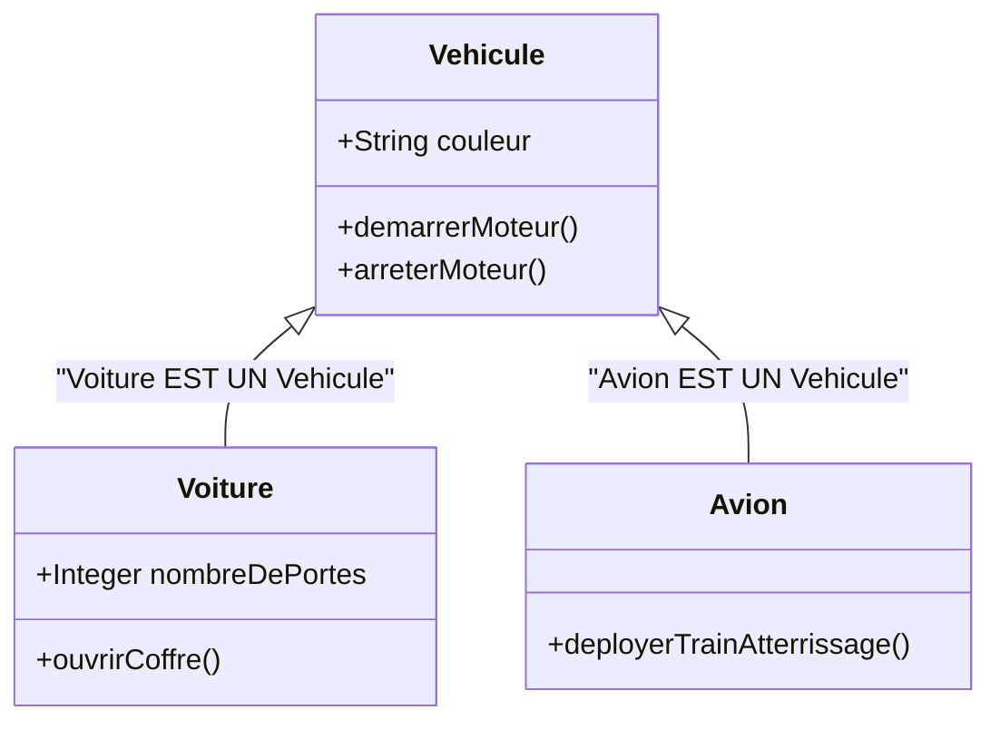
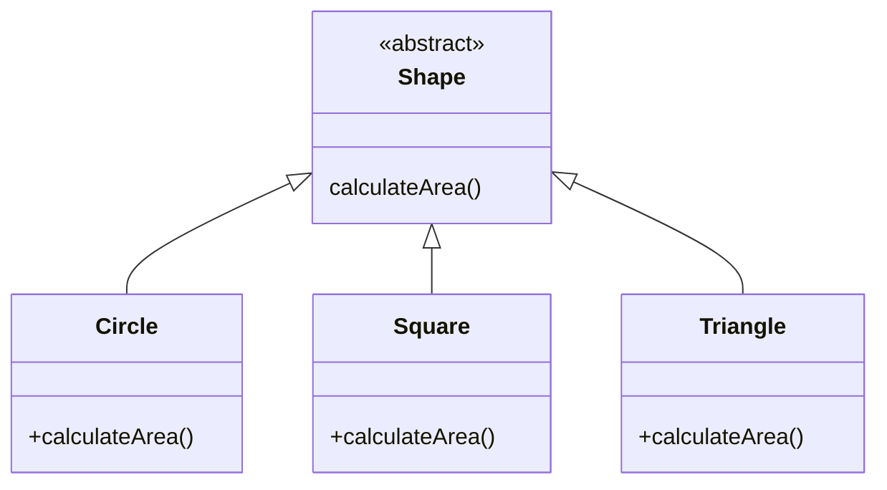
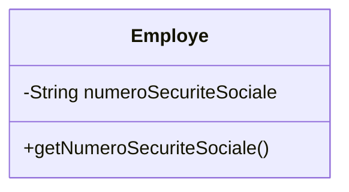
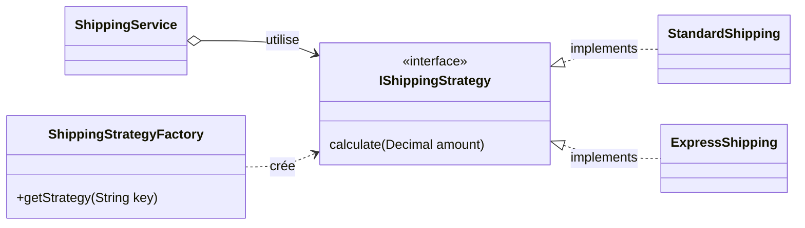
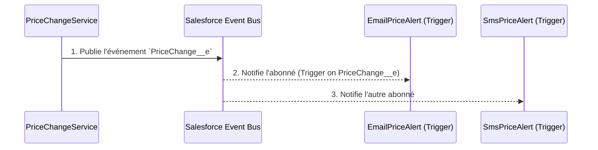

# Formation d'Expert : POO & Design Patterns en Apex

Ce document est un guide de référence approfondi pour les développeurs Salesforce visant la maîtrise de la **Programmation Orientée Objet (POO)** et des **Design Patterns** en Apex. Chaque section est structurée pour fournir une compréhension conceptuelle, une visualisation architecturale, et une analyse du code source réel présent dans ce projet.

---

## Partie 1 : Les Piliers de la Programmation Orientée Objet (POO)

La POO est une philosophie de conception qui nous permet de modéliser des problèmes complexes sous forme d'objets logiciels autonomes et interactifs.

### 1. L'Héritage (`/LesBasesDePOO/HeritageEnPOO`)

**Concept d'Expert :** L'héritage modélise une relation **"EST UN(E)"**. Il permet de créer une hiérarchie de classes où les sous-classes héritent des caractéristiques (propriétés et méthodes) de leur super-classe. L'objectif est la réutilisabilité et la création d'une taxonomie claire.

#### Diagramme de Classes


#### Analyse du Code Source
- **`Vehicule.cls`** définit le comportement commun. C'est la base de notre hiérarchie.
- **`Voiture.cls`** étend `Vehicule` en utilisant le mot-clé `extends`. Elle hérite de `demarrerMoteur()` et y ajoute son propre comportement `ouvrirCoffre()`.

*Extrait de `Voiture.cls`:*
```apex
public class Voiture extends Vehicule {
    public Integer nombreDePortes;

    public Voiture(String couleur, Integer nombreDePortes) {
        super(couleur); // Appel au constructeur de la classe mère
        this.nombreDePortes = nombreDePortes;
    }

    public void ouvrirCoffre() {
        System.debug('Ouverture du coffre de la voiture à ' + this.nombreDePortes + ' portes.');
    }
}
```

**Utilisation :** Le script `[Demo001] HeritageEnOOP.apex` montre comment instancier et utiliser ces classes.

---

### 2. Le Polymorphisme (`/LesBasesDePOO/PolymorphismeEnPOO`)

**Concept d'Expert :** Le polymorphisme ("plusieurs formes") permet de traiter des objets de types différents de manière uniforme via une interface ou une classe de base commune. Le code client dépend de l'abstraction (`Shape`) et non des implémentations concrètes (`Circle`, `Square`). Cela rend le système extensible et respecte le [Principe d'Inversion de Dépendances](https://en.wikipedia.org/wiki/Dependency_inversion_principle).

#### Diagramme de Classes


#### Analyse du Code Source
- **`Shape.cls`** est une classe `abstract` qui définit un contrat : toute classe qui en hérite *doit* fournir une implémentation pour la méthode `calculateArea()`.
- **`Circle.cls`** et les autres formes héritent de `Shape` et utilisent `override` pour fournir leur propre logique de calcul.

*Extrait de `Circle.cls`:*
```apex
public class Circle extends Shape {
    private Double radius;

    public Circle(Double r) {
        this.radius = r;
    }

    public override Double calculateArea() {
        return Math.PI * this.radius * this.radius;
    }
}
```

**Utilisation :** Le script `[Demo002] PolymorphismeEnOOP.apex` illustre comment une liste de `Shape` peut contenir différents types d'objets et comment l'appel à `calculateArea()` exécute la bonne version de la méthode.

---

### 3. L'Encapsulation (`/LesBasesDePOO/EncapsulationEnPOO`)

**Concept d'Expert :** L'encapsulation consiste à lier les données (attributs) et les méthodes qui les manipulent au sein d'un même objet, tout en cachant l'état interne de cet objet au monde extérieur. L'accès aux données est contrôlé par des méthodes publiques (getters/setters). L'objet est seul responsable de la validité de son propre état.

#### Diagramme de Classes


#### Analyse du Code Source
- **`Employe.cls`** : Le champ `numeroSecuriteSociale` est déclaré `private`, le rendant inaccessible depuis l'extérieur de la classe. Une méthode publique `getNumeroSecuriteSociale()` est fournie pour permettre un accès en lecture seule et contrôlé.

*Extrait de `Employe.cls`:*
```apex
public class Employe extends Personne {
    private String numeroSecuriteSociale;
    public String poste;

    // ... constructeur ...

    public String getNumeroSecuriteSociale() {
        // On pourrait ajouter ici une logique de sécurité
        // (ex: vérifier les permissions de l'utilisateur courant)
        return this.numeroSecuriteSociale;
    }
}
```

**Utilisation :** Le script `[Demo003] EncapsulationEnOOP.apex` montre qu'un appel direct à `e.numeroSecuriteSociale` échouerait, forçant l'utilisation du getter.

---

## Partie 2 : Les Design Patterns

Les Design Patterns sont des solutions architecturales réutilisables à des problèmes de conception logicielle courants.

### 1. Strategy (`/SystemDesignPatterns/Strategy`)

**Concept d'Expert :** Le pattern Strategy permet de définir une famille d'algorithmes, de les encapsuler dans des classes séparées et de les rendre interchangeables. Le contexte délègue l'exécution de l'algorithme à un objet stratégie. C'est une alternative propre aux blocs conditionnels complexes (`if/else`).

#### Diagramme de Classes


#### Analyse du Code Source
- **`ShippingStrategy.cls`** est l'interface qui définit le contrat pour toutes les stratégies.
- **`StandardShipping.cls`**, **`ExpressShipping.cls`**, etc., sont les implémentations concrètes de l'algorithme.
- **`ShippingStrategyFactory.cls`** (une Factory) est responsable de sélectionner et d'instancier la bonne stratégie, souvent en se basant sur des Custom Metadata, ce qui rend le système configurable sans modification du code.

*Extrait de `ShippingStrategyFactory.cls`:*
```apex
public class ShippingStrategyFactory {
    public static IShippingStrategy getStrategy(String strategyName) {
        // Logique pour trouver le nom de la classe Apex
        // dans un Custom Metadata Type basé sur strategyName
        // ...
        // Instanciation dynamique
        Type t = Type.forName(metadata.ApexClass__c);
        return (IShippingStrategy) t.newInstance();
    }
}
```

**Utilisation :** Le script `[Demo011] Strategy‐via‐Custom‐Metadata.apex` montre comment le `ShippingService` utilise la factory pour obtenir la bonne stratégie et calculer les frais.

---

### 2. Observer (`/SystemDesignPatterns/Observer`)

**Concept d'Expert :** Le pattern Observer établit une relation un-à-plusieurs entre des objets, de sorte que lorsqu'un objet (le Sujet) change d'état, tous ses dépendants (les Observateurs) sont notifiés et mis à jour automatiquement. Dans Salesforce, les **Platform Events** sont l'implémentation native, asynchrone et découplée de ce pattern.

#### Diagramme de Séquence


#### Analyse du Code Source
- **`PriceChangePublisher.cls`** (le Sujet) est responsable de la publication de l'événement `PriceChange__e` sur le bus d'événements Salesforce. Il ne connaît pas ses observateurs.
- **`EmailPriceAlert.cls`** (un Observateur) est un trigger Apex sur l'objet `PriceChange__e`. Il s'exécute automatiquement chaque fois qu'un nouvel événement est publié.

*Extrait de `PriceChangePublisher.cls`:*
```apex
public class PriceChangePublisher {
    public static void publish(Set<Id> productIds, Decimal newPrice) {
        List<PriceChange__e> events = new List<PriceChange__e>();
        for (Id prodId : productIds) {
            events.add(new PriceChange__e(ProductId__c = prodId, NewPrice__c = newPrice));
        }
        EventBus.publish(events);
    }
}
```

**Utilisation :** Le script `[Demo010] Observer.apex` simule une mise à jour de prix, qui appelle le service, qui à son tour publie l'événement, déclenchant les processus d'alerte en arrière-plan.

---

*Ce document a été généré en se basant sur l'analyse des fichiers de classes (`.cls`) présents dans le répertoire `force-app/main/default/classes/`.*

Ce projet a été créé par **@[DevoTeam]**.