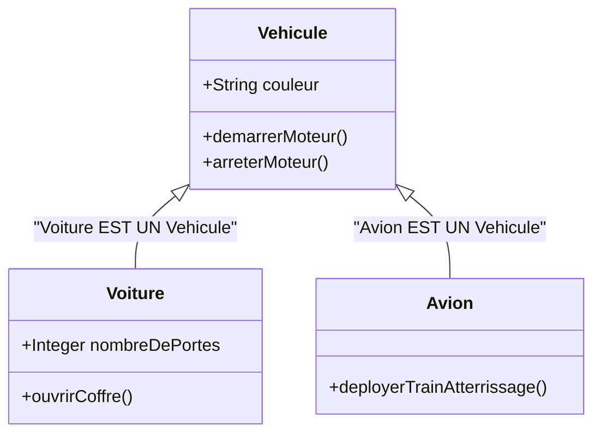
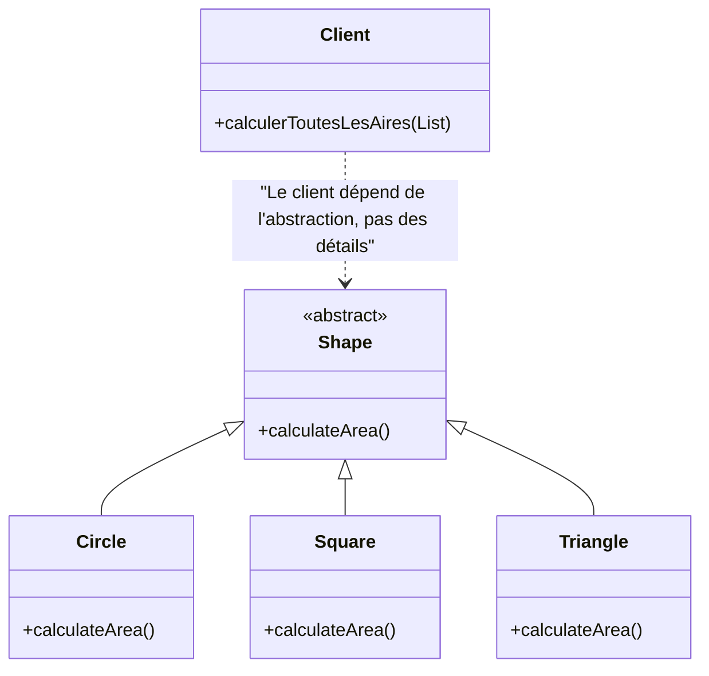
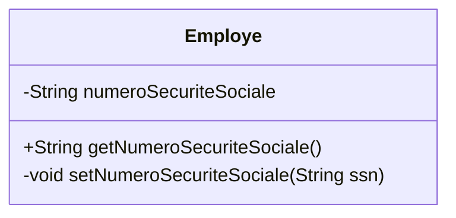
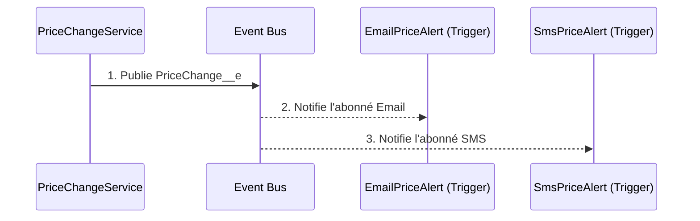

# Formation d'Expert : POO & Design Patterns en Apex

Ce document est un guide approfondi destiné aux développeurs Salesforce qui souhaitent maîtriser la **Programmation Orientée Objet (POO)** et les **Design Patterns**. L'objectif n'est pas seulement de comprendre la théorie, mais de devenir un expert capable de concevoir des solutions Apex robustes, maintenables et évolutives.

---

## Partie 1 : Les Piliers de la Programmation Orientée Objet (POO)

La POO est plus qu'une technique, c'est une philosophie de conception. Elle nous permet de modéliser le monde réel sous forme d'objets logiciels qui interagissent entre eux. Maîtriser ses piliers est la première étape pour écrire du code propre et professionnel.

### 1. L'Héritage : Créer des Hiérarchies et Réutiliser

**Le Concept d'Expert :** L'héritage modélise une relation **"EST UN(E)"**. Une `Voiture` EST UN `Vehicule`. Ce n'est pas seulement une question de réutilisation du code ; il s'agit de créer une taxonomie, un langage commun pour votre domaine d'application. En établissant une hiérarchie claire, vous rendez votre code plus intuitif et plus facile à comprendre pour les autres développeurs.

**Dans le contexte Salesforce :** Pensez à la manière dont tous les objets Salesforce (Account, Contact, etc.) héritent implicitement d'un `SObject`. C'est pour cela qu'on peut les traiter de manière générique pour les opérations DML.

#### Diagramme de Classes Simplifié


*Légende : La flèche `A <|-- B` signifie que B hérite de A.*

#### Analyse de la Démo
Le code de la démo illustre parfaitement ce principe. `Voiture` et `Avion` n'ont pas besoin de redéfinir `demarrerMoteur()`. Ils l'acquièrent "gratuitement" de `Vehicule`. Le véritable pouvoir ici est que si vous devez modifier la logique de démarrage pour *tous* les véhicules (par exemple, pour ajouter un log), vous ne le faites qu'à un seul endroit : la classe `Vehicule`.

```apex
// Fichier : [Demo001] HeritageEnOOP.apex
// Instanciation d’une Voiture
Voiture maVoiture = new Voiture('rouge', 4);
maVoiture.demarrerMoteur(); // Appel d'une méthode héritée
maVoiture.ouvrirCoffre();   // Appel d'une méthode spécifique
```

---

### 2. Le Polymorphisme : Un Comportement, Plusieurs Formes

**Le Concept d'Expert :** Le polymorphisme est le pilier qui permet le découplage le plus puissant. Il signifie qu'un code client peut manipuler des objets via une interface ou une classe de base commune sans connaître leur type concret. Le code client demande une action (`calculateArea()`), et c'est l'objet lui-même qui sait comment la réaliser. Cela rend les systèmes extensibles : vous pouvez ajouter de nouvelles `Shape`s (ex: `Rectangle`, `Hexagone`) sans jamais modifier la boucle de calcul qui parcourt la liste.

#### Diagramme de Classes Simplifié


*Légende : La ligne pointillée `A ..> B` signifie que A dépend de B.*

#### Analyse de la Démo
La magie est dans la `List<Shape>`. Cette liste contient des objets hétérogènes (`Circle`, `Square`, `Triangle`). Pourtant, la boucle `for` les traite tous de la même manière, comme de simples `Shape`. Quand `s.calculateArea()` est appelé, le système d'exécution d'Apex (runtime) détermine le type réel de `s` et invoque la méthode `override` correspondante. C'est l'essence même du polymorphisme.

```apex
// Fichier : [Demo002] PolymorphismeEnOOP.apex
List<Shape> shapes = new List<Shape>{ /* ... */ };

// Cette boucle est stable. Elle n'a pas besoin de changer
// si on ajoute une nouvelle forme demain.
for (Shape s : shapes) {
    // L'appel est le même, mais le résultat dépend du type réel de 's'
    System.debug('Area = ' + s.calculateArea());
}
```

---

### 3. L'Encapsulation : Protéger l'Intégrité de l'Objet

**Le Concept d'Expert :** L'encapsulation n'est pas juste une question de cacher des données avec le mot-clé `private`. C'est une question de **responsabilité**. Un objet doit être responsable de la cohérence de son propre état. En exposant des méthodes publiques (comme `getNumeroSecuriteSociale`) au lieu de variables publiques, l'objet conserve le contrôle. Il peut valider les données, déclencher des logiques, notifier d'autres objets, etc., chaque fois que son état est consulté ou modifié. Vous créez des objets qui sont des gardiens fiables de leurs propres données.

#### Diagramme de Classes Simplifié



#### Analyse de la Démo
L'exemple montre que l'accès direct à `numeroSecuriteSociale` est interdit. C'est la base. Mais imaginez que le `setter` (non montré dans la démo mais implicite) contienne une logique de validation : `if (ssn.length() != 11) { throw new Exception(...); }`. L'encapsulation garantit que personne ne peut contourner cette validation. L'objet `Employe` garantit qu'il ne peut jamais exister dans un état invalide (avec un SSN mal formé).

```apex
// Fichier : [Demo003] EncapsulationEnOOP.apex
Employe e = new Employe(...);

// INTERDIT : Le code externe ne peut pas corrompre l'état de l'objet.
// e.numeroSecuriteSociale = 'invalide'; // Erreur de compilation

// AUTORISÉ : On passe par le point d'accès contrôlé.
String ssn = e.getNumeroSecuriteSociale();
```

---

## Partie 2 : Les Design Patterns

Les Design Patterns sont des solutions architecturales éprouvées. Les connaître, c'est comme avoir une boîte à outils de plans pour construire des logiciels de qualité.

### 1. Strategy : Rendre les Algorithmes Interchangeables

**Le Concept d'Expert :** Le pattern Strategy est l'antidote aux instructions `if-else-if` ou `switch` interminables. Il repose sur le principe de **délégation**. Le contexte (ici, `ShippingService`) ne réalise pas l'algorithme lui-même ; il délègue cette responsabilité à un objet "stratégie" distinct. Le véritable avantage dans Salesforce est de pouvoir charger ces stratégies dynamiquement, par exemple à partir de **Custom Metadata Types**. Cela transforme une modification de logique métier (changer un calcul de frais de port) d'une tâche de développeur (déploiement de code) à une tâche d'administrateur (modification d'un enregistrement de metadata).

#### Diagramme de Classes Simplifié

```mermaid
classDiagram
    direction LR
    class ShippingService{
      +calculate(strategy)
    }
    interface IShippingStrategy{
      <<interface>>
      calculateFee()
    }
    class StandardShipping{ +calculateFee() }
    class ExpressShipping{ +calculateFee() }

    ShippingService o--> IShippingStrategy : "utilise une stratégie"
    IShippingStrategy <|.. StandardShipping
    IShippingStrategy <|.. ExpressShipping
```
*Légende : La flèche `A o--> B` signifie que A a une relation d'agrégation avec B.*

#### Analyse de la Démo
La démo est particulièrement puissante car elle ne se contente pas d'implémenter le pattern, elle l'intègre aux fonctionnalités de la plateforme. Le `ShippingService` reçoit une clé. Au lieu de faire un `if (key == 'Standard')`, il recherche un enregistrement de Custom Metadata correspondant à cette clé. Cet enregistrement contient le nom de la classe Apex qui implémente la stratégie. Le service utilise ensuite `Type.forName(...).newInstance()` pour créer dynamiquement l'objet stratégie adéquat. C'est flexible, maintenable et aligné avec les meilleures pratiques Salesforce.

```apex
// Fichier : [Demo011] Strategy-via-Custom-Metadata.apex
// Le client ne connaît que des clés, pas des classes Apex.
List<String> keys = new List<String>{ 'Standard', 'Express', 'Free200' };

for (String key : keys) {
    // Le ShippingService trouve la bonne classe stratégie via la metadata,
    // l'instancie, et l'utilise.
    Decimal fee = ShippingService.calculate(key, 150);
}
```

### 2. Observer : Notifier les Changements sans Couplage

**Le Concept d'Expert :** Le pattern Observer résout un problème fondamental : comment des objets peuvent-ils réagir à des événements qui se produisent dans d'autres objets sans être directement liés à eux ? La solution est un mécanisme de diffusion où un "sujet" publie des notifications et des "observateurs" s'y abonnent. Dans Salesforce, les **Platform Events** sont l'implémentation parfaite et native de ce pattern. Ils créent un découplage total : le publicateur n'a aucune connaissance des abonnés. Cela permet de construire des architectures événementielles, résilientes et qui respectent les limites de la plateforme en découpant le travail en transactions courtes et indépendantes.

#### Diagramme de Séquence Simplifié



#### Analyse de la Démo
Le `PriceChangeService` fait une seule chose : il publie un `PriceChange__e`. Il ne sait pas et ne se soucie pas de savoir si un email doit être envoyé, si un SMS est nécessaire, ou si un système externe doit être appelé. Les classes `EmailPriceAlert` et `SmsPriceAlert` (implémentées sous forme de triggers sur le Platform Event) sont les observateurs. Vous pouvez ajouter un troisième observateur demain (par exemple, `PushNotificationAlert`) en ajoutant simplement un nouveau trigger, sans jamais toucher au code du `PriceChangeService`. C'est le summum du découplage.

```apex
// Fichier : [Demo010] Observer.apex
// Le service se contente de crier "Le prix a changé !" dans le vide.
PriceChangeService.checkAndPublish(oldList, newList);

// En coulisses, les triggers abonnés à cet événement se réveillent
// et font leur travail, chacun dans sa propre transaction.
```

---
Ce projet a été créé par **@[DevoTeam]**.