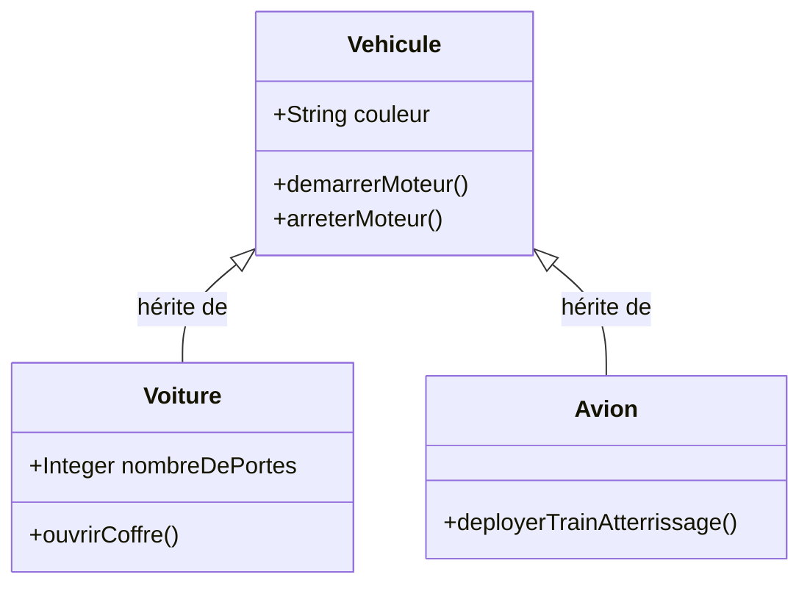
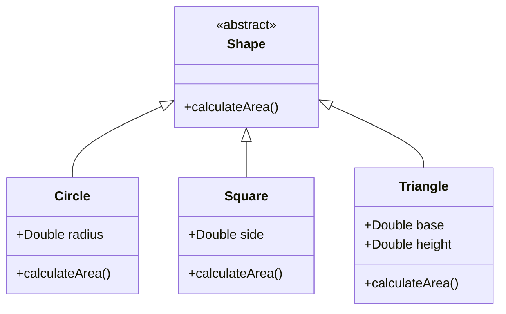
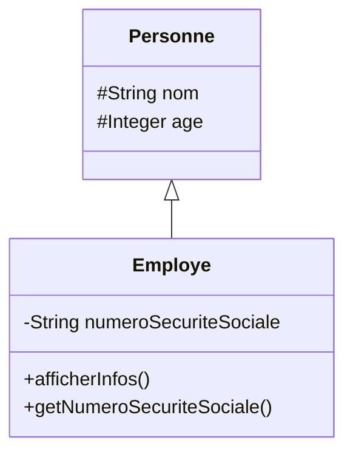
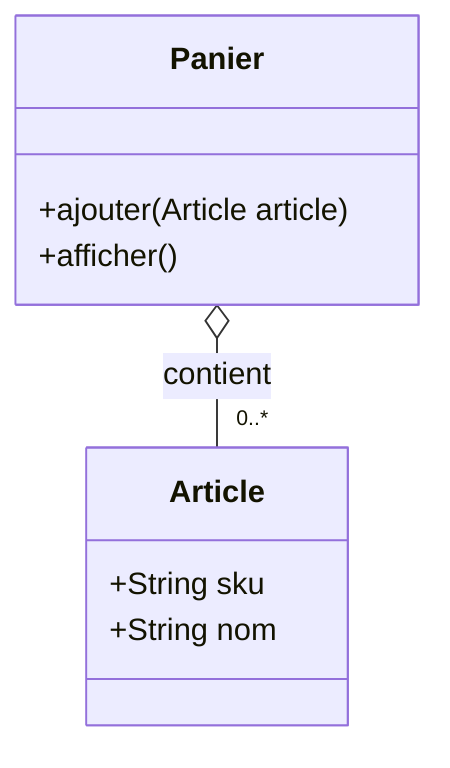
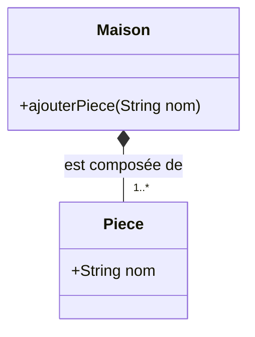
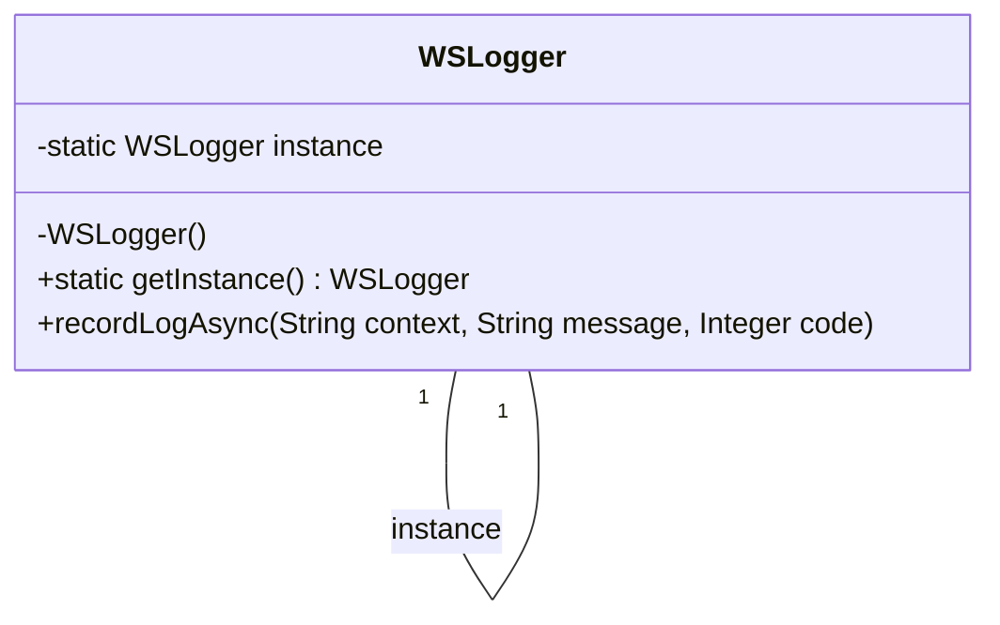
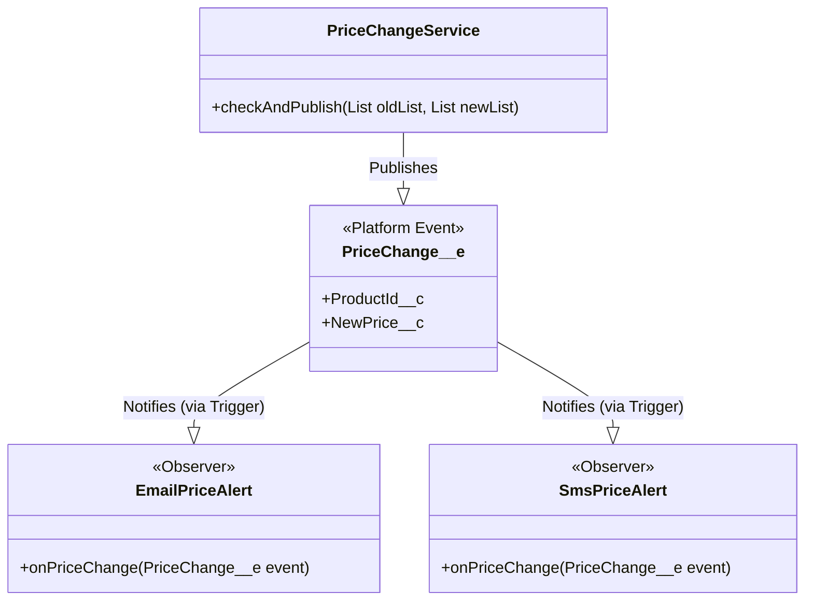

# Formation Approfondie : POO & Design Patterns en Apex

Bienvenue dans ce référentiel dédié à l'apprentissage avancé de la **Programmation Orientée Objet (POO)** et des **Design Patterns** avec le langage Apex de Salesforce. Ce document sert de guide complet, non seulement pour comprendre la théorie, mais aussi pour voir comment ces concepts sont appliqués dans des scénarios concrets grâce à des démonstrations de code.

## Partie 1 : Les Piliers de la Programmation Orientée Objet (POO)

La POO est un paradigme de programmation qui utilise des "objets" pour concevoir des applications et des logiciels. Ces objets, qui sont des instances de classes, combinent des données (attributs) et des comportements (méthodes).

---

### 1. L'Héritage

> **L'héritage** est un mécanisme qui permet à une nouvelle classe (dite "classe fille" ou "sous-classe") de réutiliser, étendre et modifier le comportement défini dans une autre classe (dite "classe mère" ou "super-classe"). Le principal avantage est la réutilisabilité du code et la création d'une hiérarchie logique entre les classes.

#### Diagramme de Classes


#### Analyse de l'implémentation Apex
Dans cet exemple, `Vehicule` est la classe de base qui définit des attributs et des méthodes communs à tous les véhicules. `Voiture` and `Avion` héritent de `Vehicule`. Elles bénéficient ainsi automatiquement des méthodes `demarrerMoteur()` et `arreterMoteur()`, sans avoir à les réécrire. De plus, elles peuvent ajouter leurs propres spécificités (`ouvrirCoffre()` pour la voiture).

#### Démonstration
```apex
// Fichier : [Demo001] HeritageEnOOP.apex
// un script Execute Anonymous

// Instanciation d’une Voiture
Voiture maVoiture = new Voiture('rouge', 4);
maVoiture.demarrerMoteur(); // Méthode héritée de Vehicule
maVoiture.ouvrirCoffre();   // Méthode propre à Voiture
maVoiture.arreterMoteur();  // Méthode héritée de Vehicule

// Instanciation d’un Avion
Avion monAvion = new Avion('blanc');
monAvion.demarrerMoteur(); // Méthode héritée de Vehicule
monAvion.arreterMoteur();  // Méthode héritée de Vehicule
```

---

### 2. Le Polymorphisme

> **Le polymorphisme** (du grec "plusieurs formes") permet d'utiliser un objet d'une classe fille partout où un objet de sa classe mère est attendu. Concrètement, cela permet d'appeler la même méthode sur des objets de types différents et d'obtenir un comportement spécifique à chaque type. En Apex, cela est souvent réalisé en déclarant une méthode `virtual` dans la classe mère et en la redéfinissant avec `override` dans les classes filles.

#### Diagramme de Classes


#### Analyse de l'implémentation Apex
`Shape` est une classe abstraite qui définit un "contrat" : toute forme doit pouvoir calculer son aire (`calculateArea`). `Circle`, `Square`, et `Triangle` sont des implémentations concrètes. On peut les stocker dans une `List<Shape>` et appeler `calculateArea()` sur chaque élément. Apex exécutera la version correcte de la méthode en fonction du type réel de l'objet au moment de l'exécution.

#### Démonstration
```apex
// Fichier : [Demo002] PolymorphismeEnOOP.apex
List<Shape> shapes = new List<Shape>{
    new Circle(5),
    new Square(4),
    new Triangle(5, 2)
};

// Grâce au polymorphisme, on parcourt la liste unifiée
// et on appelle la même méthode sur des objets différents.
for (Shape s : shapes) {
    String typeName;
    if (s instanceof Circle)      typeName = 'Circle';
    else if (s instanceof Square) typeName = 'Square';
    else                          typeName = 'Triangle';
    System.debug('Area of ' + typeName + ' = ' + s.calculateArea());
}
```

---

### 3. L'Encapsulation

> **L'encapsulation** est le principe de cacher l'état interne d'un objet et de ne permettre l'interaction qu'à travers des méthodes publiques (getters/setters). Cela protège l'intégrité des données de l'objet, empêche les modifications accidentelles et permet de faire évoluer l'implémentation interne sans impacter le code qui l'utilise.

#### Diagramme de Classes


#### Analyse de l'implémentation Apex
Dans l'exemple, `numeroSecuriteSociale` est `private`. Il est impossible d'y accéder directement depuis l'extérieur de la classe `Employe`. Pour obtenir sa valeur, le code externe est obligé de passer par la méthode publique `getNumeroSecuriteSociale()`. Cela permet à la classe `Employe` de contrôler l'accès (par exemple, ajouter une vérification de permissions avant de retourner la valeur).

#### Démonstration
```apex
// Fichier : [Demo003] EncapsulationEnOOP.apex
Employe e = new Employe('Dupont', 30, '123-45-6789', 'Développeur');

// Accès public OK
System.debug('Age (public) : ' + e.age);

// Accès direct au membre privé IMPOSSIBLE (génère une erreur de compilation)
// System.debug('SSN direct : ' + e.numeroSecuriteSociale);

// On doit utiliser le "getter" public
String ssn = e.getNumeroSecuriteSociale();
System.debug('SSN via getter : ' + ssn);

e.afficherInfos();
```

---

### 4. L'Abstraction

> **L'abstraction** consiste à masquer la complexité de l'implémentation en exposant uniquement les fonctionnalités de haut niveau. Elle se concentre sur ce qu'un objet *fait* plutôt que sur comment il le *fait*. En Apex, l'abstraction est réalisée via des classes abstraites et des interfaces.

#### Diagramme de Classes
```mermaid
classDiagram
    class NotificationService{
        +static notifyUser(Notifier notifier, String message)
    }
    interface Notifier{
        <<interface>>
        +send(String message)
    }
    class EmailNotifier{
        +send(String message)
    }
    class SmsNotifier{
        +send(String message)
    }

    Notifier <|.. EmailNotifier : implements
    Notifier <|.. SmsNotifier : implements
    NotificationService ..> Notifier : uses
```

#### Analyse de l'implémentation Apex
Le `NotificationService` ne sait pas comment un message est envoyé (par email, SMS, etc.). Il sait seulement qu'il a besoin d'un objet de type `Notifier` qui respecte le contrat défini par l'interface (la méthode `send`). On peut ainsi ajouter de nouveaux types de notificateurs (Push, Slack...) sans jamais avoir à modifier le `NotificationService`.

#### Démonstration
```apex
// Fichier : [Demo004] AbstractionEnOOP.apex
System.debug('--- Début démo Notification ---');

// 1) Notification par e-mail
Notifier email = new EmailNotifier();
NotificationService.notifyUser(email, 'Votre rapport est prêt !');

// 2) Notification par SMS
Notifier sms = new SmsNotifier();
NotificationService.notifyUser(sms, 'Vérifiez votre téléphone.');

System.debug('--- Fin démo Notification ---');
```

---

### 5. L'Agrégation

> **L'agrégation** est une relation de type "a un" (has-a) entre deux classes, où une classe (le tout) est composée d'une ou plusieurs autres classes (les parties). C'est une association faible : les objets "partie" peuvent exister indépendamment de l'objet "tout".

#### Diagramme de Classes


#### Analyse de l'implémentation Apex
Un `Panier` contient des `Article`s. Cependant, si on supprime un `Panier`, les `Article`s existent toujours et peuvent être ajoutés à un autre panier. Leur cycle de vie n'est pas lié.

#### Démonstration
```apex
// Fichier : [Demo005] Agrégation en POO.apex
// Création d'articles indépendants
Article stylo  = new Article('A001', 'Stylo');
Article cahier = new Article('A002', 'Cahier');

// Deux paniers qui partagent le même article "cahier"
Panier panier1 = new Panier();
panier1.ajouter(stylo);
panier1.ajouter(cahier);

Panier panier2 = new Panier();
panier2.ajouter(cahier); // Le même objet 'cahier'

panier1.afficher();
panier2.afficher();
```

---

### 6. La Composition

> **La composition** est une forme forte d'agrégation. C'est aussi une relation "a un", mais ici, le cycle de vie des objets "partie" dépend de celui de l'objet "tout". Si l'objet "tout" est détruit, ses parties le sont aussi.

#### Diagramme de Classes


#### Analyse de l'implémentation Apex
Une `Maison` est composée de `Piece`s. Une `Piece` (comme un salon) ne peut pas exister sans une `Maison` à laquelle appartenir. Dans le code, la `Maison` est responsable de la création de ses `Piece`s.

#### Démonstration
```apex
// Fichier : [Demo006] Composition en POO.apex
Maison m = new Maison();
m.ajouterPiece('Salon');
m.ajouterPiece('Cuisine');

for (Piece p : m.getPieces()) {
    System.debug('Pièce : ' + p.nom);
}
// Si l'objet 'm' est détruit, les pièces qu'il contient n'ont plus de sens.
```

---

### 7. L'Implémentation Multiple d'Interfaces

> Apex ne supporte pas l'héritage multiple de classes (une classe ne peut hériter que d'une seule autre classe). Cependant, une classe peut **implémenter plusieurs interfaces**. Cela lui permet d'hériter de plusieurs "comportements" ou "contrats" différents.

#### Diagramme de Classes
```mermaid
classDiagram
    interface Imprimable {
        <<interface>>
        imprimer()
    }
    interface Exportable {
        <<interface>>
        exporter()
    }
    class Document {
        imprimer()
        exporter()
    }
    Imprimable <|.. Document
    Exportable <|.. Document
```

#### Analyse de l'implémentation Apex
La classe `Document` promet de fournir une implémentation pour les méthodes définies dans `Imprimable` ET `Exportable`. Cela permet de passer un objet `Document` à des méthodes qui attendent un `Imprimable` et à d'autres qui attendent un `Exportable`.

#### Démonstration
```apex
// Fichier : [Demo007] Implémentation Multiple.apex
Document doc = new Document();

// On peut traiter l'objet 'doc' de différentes manières
// en fonction de l'interface qui nous intéresse.
DocumentService.traiterImpression(doc); // La méthode attend un Imprimable
DocumentService.traiterExport(doc);   // La méthode attend un Exportable
```

---
---

## Partie 2 : Les Design Patterns

Les Design Patterns (ou patrons de conception) sont des solutions éprouvées à des problèmes de conception logicielle récurrents.

---

### 1. Singleton

> Le **Singleton** est un pattern de création qui garantit qu'une classe n'a qu'une seule et unique instance, tout en fournissant un point d'accès global à cette instance. C'est utile pour gérer des ressources partagées comme une connexion à une base de données, un service de logging, ou un cache.

#### Diagramme de Classes


#### Analyse de l'implémentation Apex
Le constructeur de `WSLogger` est privé, ce qui empêche la création d'instances avec `new WSLogger()`. La seule façon d'obtenir un objet `WSLogger` est d'appeler la méthode statique `getInstance()`. Cette méthode crée l'instance si elle n'existe pas, ou retourne l'instance existante dans le cas contraire, garantissant son unicité au sein d'une transaction.

#### Démonstration
```apex
// Fichier : [Demo008] Singleton.apex
// Plusieurs clients dans différentes parties du code
// appellent le logger, mais ils utilisent tous la MÊME instance.

// Client 1
try {
    // ...
} catch (Exception ex) {
    // Pas de 'new', on utilise le point d'accès global
    WSLogger.recordLogAsync('Client_001.fetchData', ex.getMessage(), 500);
}

// Client 2
try {
    // ...
} catch (Exception ex) {
    WSLogger.recordLogAsync('Client_002.fetchData', ex.getMessage(), 501);
}
```

---

### 2. Factory Method

> Le **Factory Method** est un pattern de création qui définit une interface pour créer un objet, mais laisse les sous-classes décider de la classe à instancier. Il permet de déléguer la logique d'instanciation à des sous-classes.

#### Diagramme de Classes
```mermaid
classDiagram
    class NotificationService {
        +static notify(String type, String recipient, String message)
    }
    interface INotifier {
        <<interface>>
        send(String recipient, String message)
    }
    class EmailSender {
        send(String recipient, String message)
    }
    class SmsSender {
        send(String recipient, String message)
    }
    class PushSender {
        send(String recipient, String message)
    }

    INotifier <|.. EmailSender
    INotifier <|.. SmsSender
    INotifier <|.. PushSender
    NotificationService ..> INotifier : creates
```

#### Analyse de l'implémentation Apex
Le `NotificationService` agit comme une usine (Factory). En fonction du `type` fourni ('EMAIL', 'SMS', etc.), il instancie la classe `INotifier` appropriée et l'utilise pour envoyer le message. Le code client n'a pas besoin de connaître les classes concrètes (`EmailSender`, `SmsSender`).

#### Démonstration
```apex
// Fichier : [Demo009] Factory Method.apex
System.debug('=== Début de la démo Factory Method ===');

List<String> types = new List<String>{ 'EMAIL', 'SMS', 'PUSH', 'SLACK', 'UNKNOWN' };

for (String t : types) {
    // Le client demande simplement un type de notification.
    // La Factory se charge de créer le bon objet.
    NotificationService.notify(t,
        'recipient_placeholder',
        'Bonjour via ' + t
    );
}

System.debug('=== Fin de la démo Factory Method ===');
```

---

### 3. Observer

> L'**Observer** est un pattern de comportement où un objet (le "sujet") maintient une liste de ses dépendants (les "observateurs") et les notifie automatiquement de tout changement d'état. Salesforce propose une implémentation native et puissante de ce pattern via les **Platform Events**.

#### Diagramme de Classes (via Platform Events)


#### Analyse de l'implémentation Apex
Le `PriceChangeService` (le sujet) ne connaît pas ses observateurs. Il se contente de publier un événement `PriceChange__e` sur le bus d'événements de Salesforce. Des triggers Apex sur cet événement (`EmailPriceAlert`, `SmsPriceAlert`) agissent comme des observateurs. Ils s'abonnent à l'événement et se déclenchent dès qu'un nouvel événement est publié, créant un découplage total entre le publicateur et les abonnés.

#### Démonstration
```apex
// Fichier : [Demo010] Observer.apex
// On simule une mise à jour de prix
PricebookEntry pbe = [SELECT Id, UnitPrice, Product2Id FROM PricebookEntry LIMIT 1];
List<PricebookEntry> oldList = new List<PricebookEntry>{ pbe.clone() };
pbe.UnitPrice = pbe.UnitPrice * 1.10;
update pbe;
List<PricebookEntry> newList = new List<PricebookEntry>{ pbe };

// Le service publie l'événement. Les observateurs (triggers)
// réagiront automatiquement en arrière-plan.
PriceChangeService.checkAndPublish(oldList, newList);
```

---

### 4. Strategy

> Le pattern **Strategy** est un pattern de comportement qui permet de définir une famille d'algorithmes, de les encapsuler dans des objets et de les rendre interchangeables. Le client peut ainsi varier l'algorithme utilisé indépendamment du contexte qui l'utilise.

#### Diagramme de Classes
```mermaid
classDiagram
    class ShippingService {
        +static calculate(String strategyKey, Decimal amount)
    }
    interface IShippingStrategy {
        <<interface>>
        calculate(Decimal amount)
    }
    class StandardShipping {
        calculate(Decimal amount)
    }
    class ExpressShipping {
        calculate(Decimal amount)
    }
    class FreeShipping {
        calculate(Decimal amount)
    }

    IShippingStrategy <|.. StandardShipping
    IShippingStrategy <|.. ExpressShipping
    IShippingStrategy <|.. FreeShipping
    ShippingService ..> IShippingStrategy : uses
```

#### Analyse de l'implémentation Apex
Le `ShippingService` est le contexte. Au lieu d'implémenter la logique de calcul avec des `if/else` complexes, il délègue le calcul à un objet "stratégie". Dans cette démo, les stratégies sont définies dans des Custom Metadata, ce qui permet à un administrateur de modifier ou d'ajouter des stratégies de calcul de frais de port sans modifier le code Apex.

#### Démonstration
```apex
// Fichier : [Demo011] Strategy-via-Custom-Metadata.apex
List<String> keys = new List<String>{ 'Standard', 'Express', 'Free200', 'Unknown' };

for (String key : keys) {
    try {
        // Le service sélectionne la bonne stratégie en fonction de la clé
        // et l'utilise pour effectuer le calcul.
        Decimal fee = ShippingService.calculate(key, 150);
        System.debug('▶️ [' + key + '] Shipping for €150 → ' + fee);
    } catch (Exception ex) {
        System.debug('❌ [' + key + '] Erreur : ' + ex.getMessage());
    }
}
```

---

### 5. Decorator

> Le **Decorator** est un pattern structurel qui permet d'ajouter dynamiquement de nouvelles fonctionnalités à un objet sans modifier sa classe. Il enveloppe l'objet original dans un autre objet (le "décorateur") qui possède la même interface.

#### Diagramme de Classes
```mermaid
classDiagram
    interface IReportFormatter {
        <<interface>>
        format(Opportunity opp) List<String>
    }
    class DefaultReportFormatter {
        format(Opportunity opp) List<String>
    }
    class FormatterDecorator {
        <<abstract>>
        #IReportFormatter wrappee
        format(Opportunity opp) List<String>
    }
    class USADecorator {
        format(Opportunity opp) List<String>
    }
    class EuropeDecorator {
        format(Opportunity opp) List<String>
    }

    IReportFormatter <|.. DefaultReportFormatter
    IReportFormatter <|.. FormatterDecorator
    FormatterDecorator o-- "1" IReportFormatter : wraps
    FormatterDecorator <|-- USADecorator
    FormatterDecorator <|-- EuropeDecorator
```

#### Analyse de l'implémentation Apex
On part d'un formateur de base (`DefaultReportFormatter`). On peut ensuite l'envelopper (`decorate`) avec `USADecorator` pour ajouter le formatage de la devise en USD, puis envelopper le résultat avec `EuropeDecorator` pour convertir au format EUR. Chaque décorateur ajoute une "couche" de fonctionnalité tout en restant compatible avec l'interface `IReportFormatter`.

#### Démonstration
```apex
// Fichier : [Demo012] Decorator .apex
// Cette démo montre comment on peut chaîner les décorateurs
// pour construire un comportement complexe.
ReportGenerator.demo();

// Dans ReportGenerator.demo():
// 1. Crée un formateur de base
IReportFormatter formatter = new DefaultReportFormatter();
// 2. L'enveloppe avec un premier décorateur
formatter = new USADecorator(formatter);
// 3. L'enveloppe avec un second décorateur
formatter = new EuropeDecorator(formatter);
// 4. Utilise l'objet final, entièrement décoré
formatter.format(opp);
```

---
Ce projet a été créé par **@[DevoTeam]**.
